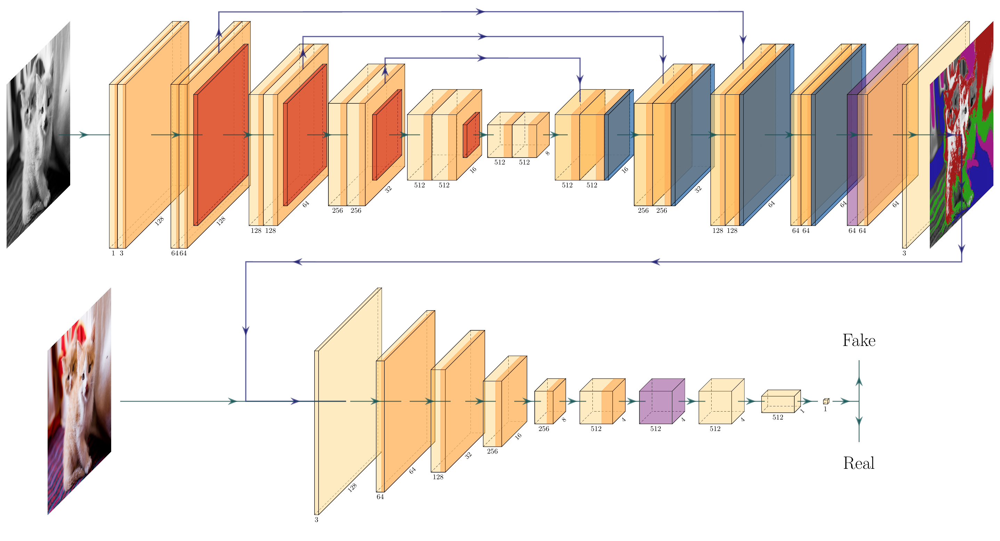

# Colorizing Things
let's add some colors to this dull world.

Group members: Dariush Mollet, Anthony Gillioz

## Objectives:
Goal: Create a hand-by-hand network which will colorize black and white images.

## Introduction:

This is a semester project for the "Advanced topics in Machine learning" course. The main goal of this project is to apply the theory seen in class on a concret project. 

Colorizing pictures is an hard problem. Indeed, a car can have multiple colors (blue, red, black, ...), the sky can also have nuance of blue so how can an algorithm find the exact color of a car or of the sky, when the picture was taken ? Since this is not a finite problem, the main criterion to judge if an image has been corectly colorized is the coherence in the colorization of the objects. If a car is colorized in blue it has to be done on all the car and only on the car (the road around the car should be black, or gray). And of course, leaves tend to be green and traffic lights tend to have certain color codes as wel...

Once the general context of the project had been exposed, came the question of how to solve it. After few research, the idea to use a generative model to recreate colors seemed promising. This technique has the good property of not needing to declare a clear loss function, but that it will learn it by itself. To the contrary of other research in this field, which had to deal with this problem of defining a good loss function to recreate the most correct colors [https://richzhang.github.io/colorization/resources/colorful_eccv2016.pdf]... The network explained below will try to learn this loss function by itself.

## Method:

### Dataset:

We trained our networks on STL10 [https://cs.stanford.edu/~acoates/stl10] (trained+unlabeled) which counts a little more than 100'000 images of the 10 following classes : airplane, bird, car, cat, deer, dog, horse, monkey, ship, truck. In this dataset only 5'000 images are labeled, but like models used in this project (GAN) are unsupervised learning algorithms, there was no need for labels.

Original images (96x96) were normalized and resized to 128x128 before being grayscaled. No data augmentation of any kind was performed.

### First approches:

At the beginning of this project, the main idea was to use an encoder to extract the main features of a grayscaled image, and from those features to recreate a 2D colored image with a generator/decoder. Once the colors generated, those would be mixed with the grayscale image to recreate a colored image.
We didn't want this autoencoder to generate images "as close as possible" to the actual image, since many different color combinations can be plausible for a single grayscaled image, we went on using a GAN architecture, with the discriminator fed with fake colorized and real color images.

So the first architecture was an adversial autoencoder. This network was supposed to learn by itself to recreate the color space of the image using the adversial process of a GAN. The color space used was the CIE Lab color space, and the generator was creating the a, b dim. The a, b are then merge with the L (grayscaled image) to create the final image.

The Encoder was a pretrained vgg16 (transfer learning, using only the convolutional part of vgg16), modified to accept 1 dim in input (image in grayscale). It sends the data in a latent space Z of dim 100.
The Generator took a latent space of 100 and recreated the a, b dim of the color space. The architecture of the generator was stacks of upsampling convTranspose2d layers to recreate the a, b dim with the correct width and height.
The Discriminator took the colorized image and tried to say if it was a real image or a fake was build in symmetry of the generator, as stacks of conv2d layers.

Those networks were first tested with a vanilla GAN loss (BCELoss), then with LSGAN and Wasserstein Loss (loss functions used in this project are explained in the Sec. Loss tested).
When using BCELoss an LSGAN, we could not make the network converge. This, of course, resulted in noisy images.


Using Wasserstein Loss, we were able to produce actual patterns in images but no matter the parameters and the length of the training, results were always of poor quality (see images below), with little to no consistency over time.


We moved on to adding self-attention layers, as described by Zhang et al. (2018) [https://arxiv.org/abs/1805.08318] in both the generator and discriminator, as penultimate layers, implementing Hinge Loss on the go as described by Zhang et al. We also changed the number of generated channels, we did not generate a,b layer but the directly RGB's channels. 
This resulted in our first results where the generator actually took account of the images' edges after 40'000 iterations.


However, no big improvement was seen during the next 350'000 iterations whereas implausible patches continued appearing on certain images and some features, like grass, seemed to be very hard to colorize.


At this point we tested multiple strategies to improve our network.
The first thing was to deepen the network, going to 19 layers on the generator with the pretrained weights from vgg19.
We tried :

    - training the discriminator more than the generator, at different rates
    - adding residual connections to the generator 
    - outputing colors in the cielab colorspace and feeding this to the discriminator
    - implementing a VAE instead of AE, introducing noise before decoding
    - training the autoencoder to generate grayscales before training it to colorize images
    - implementing a shading autoencoder as described by K. Frans (2017) [https://arxiv.org/abs/1704.08834] parallel to our generator, feeding both networks to the discriminator

Results for all attempts are not shown as they generally led to worse results than with our final architecture. When results were similar and a choice had to be made between two networks, the least complex and the most memory efficient approach was always selected. In general, all networks seemed to learn to colorize images after iterating through ~1 milion images (variable batch sizes), yet most networks did (one of the following) :

    - not perform with consistency (oscillation)
    - collapsed (when using "traditional losses" such as MSE, BCE)
    - failed to sharpen colorization around the edges
    - failed to remove implausible patches of colors
    - failed to perform correctly on all types of images 

A few errors we did :

    - forgetting to normalize our data
    - not running eval() before generating data (deceivingly underrating our network)
    - using a too large of feature vector z/bottleneck is not severe enough (takes too long to train)
    - using an inappropriate loss, over and over again
    - generating too much data (saved weights) and as such exploding space on the disk, abruptly stopping the training

##### GAN Losses:

Like the learning process of a GAN is complicated (the model can collapse very easily), the loss used to train a GAN is super important. So, few losses were used in this project:

1. Vanilla Gan: Try to minimize the jensen-shanon divergence between the PDF (probability distribution function) of the original data and the PDF of the generated data.
1. Least square GAN ([LSGAN](https://arxiv.org/pdf/1611.04076.pdf)): Will also minimize the divergence between the orignal PDF and the generated PDF, but it will use X^2 pearson divergence. It will perform more stable during the learning process.
2. Wasserstein GAN ([WGAN](https://arxiv.org/pdf/1701.07875.pdf)): This loss will minimize the divergence using the wasserstein metric (earth mover). This metric has good properties like it does not explode when the 2 PDF does not overlap and there is no evidence of mode collapse using the WGAN loss.
3. Adversial hinge loss: This loss has been proposed by the [Self Attention GAN (SAGAN)](https://arxiv.org/pdf/1805.08318.pdf) paper. It works well with self attention layers.


### Final Architecture:

Our final architecture is a Unet SAGAN, making use of both self-attention layers and the Unet's residuals design as proposed by Ronneberger et al. (2015) [https://arxiv.org/pdf/1505.04597.pdf].

The generator is using the weights of the pretrained vgg19 (convolutional layers only) on Imagenet by transfer learning and all weights were trained or finetuned.

We use batch normalization and spectral normalization in the generator, activation functions are ReLu in the generator (except after the very last layer, where we use tanh) and LeakyReLu in the discriminator.

We trained our network on batch size 9 for more than 200'000 iterations, with a learning rate of 0.0001 for the generator and 0.0004 for the discriminator (both at the same rate) and then reduced the learning rates by a factor 10 and trained the discriminator twice as many times, for 100'000 more iterations.

We used hinge loss (as previously described) for both the generator and the discriminator with label smoothing at 0.9.


[Light yellow : stacks of convolutional layers, dark yellow and blue : batch normalization, red : pooling layers, purple : self-activation layers]

## Results:

Images generated from our final architecture, they are globally correct. Sometimes the model still failed to generate the correct colors, but it produces coherent results. All those images have been generated directly in RGB.


### Difficulties met:

It was really not trivial at the very begining to understand the errors we made, in particular to discover why we had such poor results with a network that seemed appropriate (based on litterature).
An other big problem was to know how well is performing our network, because there is no clear manner to measure the score of a GAN. That was only during the TA session that we learned about the Fréchet inception distance (FID) and the Inception score.

Finally, we ran into vram shortage multiple times (if not all the time...). So we had to restrain ourselves to quite small batche sizes (often less than 10 images at a time) even though we didn't work with images larger than 128x128. This probably didn't help reduce the gradients' variance accross training.

### Example of usage:

In the final_main.py file there is a function main with default values. If you want to train it from scratch you must remove load_weights or give it a None value otherwise you should write the filename of the pretrained weigths.
```python
def main():
    device = torch.device('cuda' if torch.cuda.is_available() else 'cpu')
    batch_size = 25
    n_epochs = 10
    load_weights = "_weights_2_iteration_40000.pth"

    train = Trainer(batch_size=batch_size, n_epochs=n_epochs, device=device,
                    load_weights=load_weights)

    train.train()

if __name__ == "__main__":
    main() 
```

And after to generate colors of grayscaled images:

```python
import torchvision.utils as vutils

loaders = (train.train_loader_c, train.train_loader_g)
nb_images_to_generate = 5

for i, ((img_c, _), (img_g, _)) in enumerate(zip(*loaders)):
    img_g = img_g.to(train.device)
    
    train.netG.eval()
    fakes = train.netG(img_g)
    vutils.save_image(
            fakes,
            f"eval{i+1}.png",
            nrow=5,
            normalize=True
        )
    
    if i > nb_images_to_generate:
        break
```


### What could be optimized/tested:

- Add another self attention layer in the generator. That could help to generate more precise images.
- Try to learn on a bigger dataset with less variance in the data. For example [CelebA] [http://mmlab.ie.cuhk.edu.hk/projects/CelebA.html], this dataset has only faces and it has less structures to learn it could then learn more easily to reproduce the color.
- The main limit dealing with generative model and machine learning in general is the computational power. Indeed, once a new model has been coded, practionners have to wait a lot of time before seeing results, so a more powerful GPU could help. And having more vram available could be of a great help.
- Colorizing bigger images, use this network to color HD images (1024x1024). Using a [progressive growing GAN] [https://arxiv.org/pdf/1710.10196.pdf] can be helpful to stabilize the learning process.
- Implement a FID measure to help compare different networks, in the latter parts of the testing.

## Conclusion:
By combining multiple features seen in class and proposed by other authors, we were able to come up with a generative network that yield satisfying colorization of 128x128 images.
However, multiple elements are left to be optimized as the results, in general, would definitely not convince a human eye consistently :

We were not able to make our network give satisfying results for all types of images. As such, the network seemed to either colorize mechanical structures (like cars, boats, planes) very well or, on the other hand, to excell at colorizing cats and dogs and other animals but seldom both categories convincingly. This could either suggest that our network was not complex enough to capture and remember enough features or that we were unable to train our discriminator to properly learn features of real data.

## References:
1. https://richzhang.github.io/colorization/resources/colorful_eccv2016.pdf
2. http://cs231n.stanford.edu/reports/2016/pdfs/219_Report.pdf
3. http://openaccess.thecvf.com/content_cvpr_2017/papers/Deshpande_Learning_Diverse_Image_CVPR_2017_paper.pdf
4. https://cs.stanford.edu/~acoates/stl10
5. https://arxiv.org/abs/1805.08318
6. https://arxiv.org/pdf/1611.04076.pdf
7. https://arxiv.org/pdf/1701.07875.pdf
8. https://arxiv.org/pdf/1805.08318.pdf
9. https://arxiv.org/pdf/1505.04597.pdf
10. http://mmlab.ie.cuhk.edu.hk/projects/CelebA.html
11. https://arxiv.org/pdf/1710.10196.pdf
